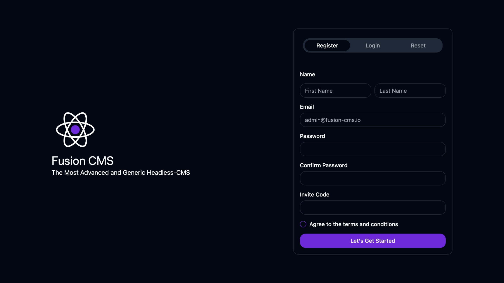
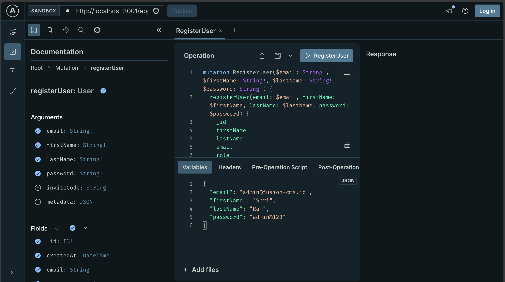

# Register user

The first user which registers to **Fusion CMS** will be by default Admin of the CMS (which can be changed later). To register the admin user please dive to the registration link displayed in the console. Registration can be done both visually through UI and programmatically through API interface or playground. 

:::tip
We Recommend using API interfaces for advanced users, since it comes up with all available setups.
:::

## Registering Admin

### Using web

Navigate to the registration path `/auth?register`

:::info
http://localhost:3001/auth?tab=register (Considering application is deployed on localhost and port 3001)
:::



Fill out your details 

- First Name (Required)
- Last Name (Required)
- Email (Required)
- Password (Required)
- Invite Code (Will be required for users other than Admin if Invited Registration is configured)

### Using API

User registrations can be done via API using GraphQL Interface / using cURL requests / Any API clients. To register admin user open the following path of your deployed route in our case 
```url
http://localhost:3001/appManager
```


You can store any number of user metadata for example country, mobile, address etc. using metadata JSON. All available field types and there descriptions are as follows

- email (required)
- firstName (required)
- lastName (required)
- password (required)
- inviteCode (optional)
- metadata (optional)

#### Full Example

```graphql title="operation"
mutation RegisterUser($email: String!, $firstName: String!, $lastName: String!, $password: String!, $inviteCode: String, $metadata: JSON) {
  registerUser(email: $email, firstName: $firstName, lastName: $lastName, password: $password, inviteCode: $inviteCode, metadata: $metadata) {
    _id
    firstName
    lastName
    email
    role
    isVerified
    isBlocked
    metadata
    createdAt
    updatedAt
  }
}
```

```JSON title="variables"
{
  "email": "admin@fusion-cms.io",
  "firstName": "Shri",
  "lastName": "Ram",
  "password": "admin@123",
  "inviteCode": "XYZ234",
  "metadata": {
    "country" : "IN",
    "phone": "+91 *********",
    "company": "IIT Kharagpur"
  },
}
```
## Registering users

Procedure for user registration is same as above. While in some cases users may need invitation code. All users need to verify their email to activate their account

:::tip
User accounts need to be activated either by admin or themselves to be functional
:::

:::tip
For link based activation a SMTP provider need to be configured
:::

:::note
Only Admins can onboard / invite users. Admins are the super users, while users can only be the consumer or creator of data. A user can be assigned as **Admin** after successful registrations
:::